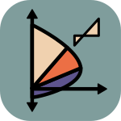

# ColCa

Un programa para el cálculo de diagramas de interacción de columnas cuadradas y de forma
T, usando el lenguaje de programación Rust 🦀 y la tecnología de Tauri para la creación de 
aplicaciones de escritorio usando Typescript como frontend

## Lanzamiento del programa
